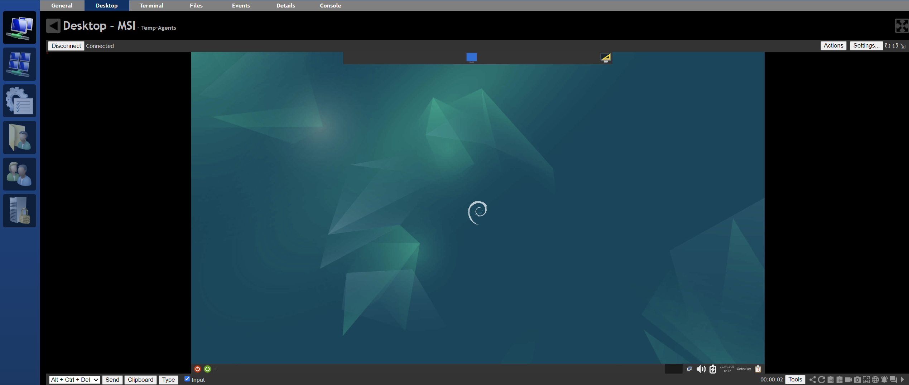

# How to manage NTOS-clients:

There are many ways to manage NTOS (Linux) agents, and people are free to help me expand this documentation!<br>
Below I will describe a couple RMM/Management solutions I am familiar with.<br>

### MeshCentral:

MeshCentral is the go-to application to use in this case - free, open-source and overal it has a great community ([More info](https://github.com/Ylianst/MeshCentral)).<br>
The way to deploy a MeshCentral-agent to a NTOS-client is to configure your desired config, such as minimal (inside [the NTOS directories](../../ntos/configs/)).<br>
For example, paste the lines below on the lines referenced in the main [README.md](../../README.md):

> Note: The below instruction is just copied from MeshCentral when clicking '*Add Agent*' -> '*Linux / BSD*' (I just split it up into multiple lines).

```
(wget "https://<your-meshcentral-location>/meshagents?script=1" -O ./meshinstall.sh \
  || wget "https://<your-meshcentral-location>/meshagents?script=1" --no-proxy -O ./meshinstall.sh) \
  && chmod 755 ./meshinstall.sh \
  && sudo -E ./meshinstall.sh https://<your-meshcentral-location> '<MESH-ID>' \
  || ./meshinstall.sh https://<your-meshcentral-location> '<MESH-ID>'
```

> Don't forget the remove the remaining files after this installation. I normally do this through `rm *mesh*`, but make sure that this does not delete other things as well.

Once you have the above lines inside the `finish.sh` script, you can actually apply it - using `finish.sh` (as in [this image](../../assets/images/debian12-finishsh-progress.png)).<br>
This should then use the MeshCentral instructions and make it pop-up in your specified group.

## Desktop:

As an example, you can 'shadow' or 'share screen' from MeshCentral.<br>



> Note: Screenshot might be out-of-date. But functionality is the same.
